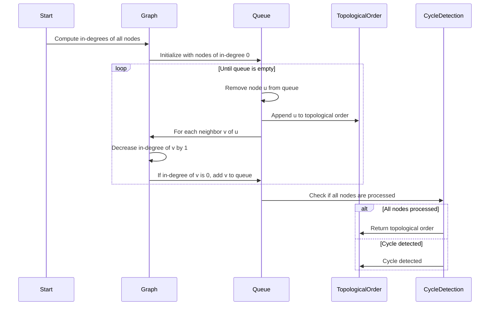

## 1. Graph Algorithms
### 1.1. Kahn's Algorithm
#### 1.1.1. Description
- Kahn's Algorithm is used for topological sorting of a directed acyclic graph (DAG).
- It works by repeatedly removing nodes with no incoming edges.

#### 1.1.2. Steps
1. Compute in-degree (number of incoming edges) for each node.
2. Initialize a queue with all nodes having in-degree of 0.
3. While the queue is not empty:
   - Remove a node from the queue.
   - Append it to the topological order.
   - Decrease the in-degree of all its neighbors by 1.
   - If any neighbor's in-degree becomes 0, add it to the queue.
4. If all nodes are processed, return the topological order; otherwise, there is a cycle.

