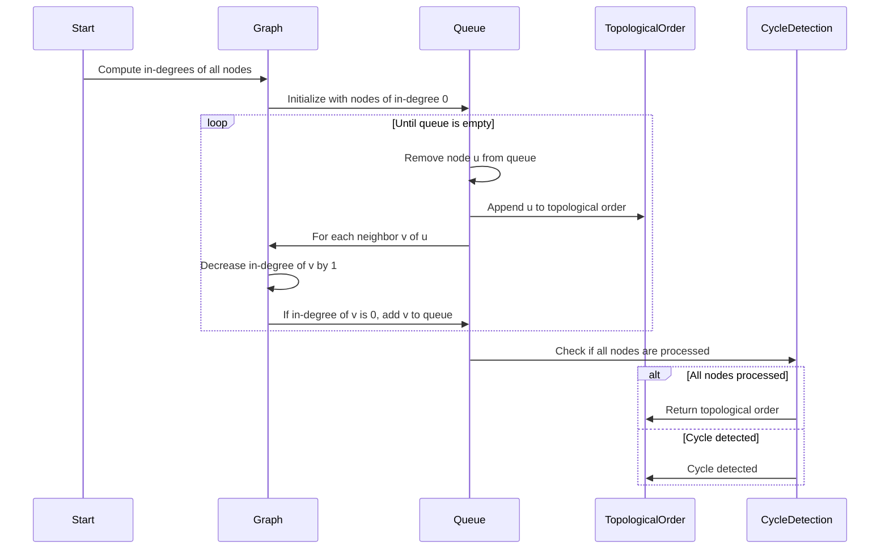

## 1. Graph Algorithms
### 1.1. Kahn's Algorithm
#### 1.1.1. Description
- Kahn's Algorithm is used for topological sorting of a directed acyclic graph (DAG).
- It works by repeatedly removing nodes with no incoming edges.

#### 1.1.2. Steps
1. Compute in-degree (number of incoming edges) for each node.
2. Initialize a queue with all nodes having in-degree of 0.
3. While the queue is not empty:
   - Remove a node from the queue.
   - Append it to the topological order.
   - Decrease the in-degree of all its neighbors by 1.
   - If any neighbor's in-degree becomes 0, add it to the queue.
4. If all nodes are processed, return the topological order; otherwise, there is a cycle.

Here's the with all the graph algorithms

| **Algorithm**          | **Description**                                           | **Java Code**                                                                                                                                          |
|------------------------|-----------------------------------------------------------|--------------------------------------------------------------------------------------------------------------------------------------------------------|
| **Depth-First Search (DFS)**    | Traverses the graph depth-ward, visiting nodes and backtracking. | void DFS(Node node) { &ensp;if (node == null) return; &ensp;visit(node); &ensp;node.visited = true; &ensp;for (Node neighbor : node.neighbors) { &ensp;&ensp;if (!neighbor.visited) { &ensp;&ensp;&ensp;DFS(neighbor); &ensp;&ensp;} &ensp;} } |
| **Breadth-First Search (BFS)**   | Traverses the graph level by level using a queue.               | void BFS(Node start) { &ensp;Queue<Node> queue = new LinkedList<>(); &ensp;queue.add(start); &ensp;start.visited = true; &ensp;while (!queue.isEmpty()) { &ensp;&ensp;Node node = queue.poll(); &ensp;&ensp;visit(node); &ensp;&ensp;for (Node neighbor : node.neighbors) { &ensp;&ensp;&ensp;if (!neighbor.visited) { &ensp;&ensp;&ensp;&ensp;queue.add(neighbor); &ensp;&ensp;&ensp;&ensp;neighbor.visited = true; &ensp;&ensp;&ensp;} &ensp;&ensp;} &ensp;} } |
| **Dijkstra's Algorithm**         | Finds the shortest path from a source to all other vertices.     | void dijkstra(Graph graph, Node source) { &ensp;PriorityQueue<Node> pq = new PriorityQueue<>(Comparator.comparingInt(n -> n.distance)); &ensp;source.distance = 0; &ensp;pq.add(source); &ensp;while (!pq.isEmpty()) { &ensp;&ensp;Node current = pq.poll(); &ensp;&ensp;for (Edge edge : current.edges) { &ensp;&ensp;&ensp;Node neighbor = edge.target; &ensp;&ensp;&ensp;int newDist = current.distance + edge.weight; &ensp;&ensp;&ensp;if (newDist < neighbor.distance) { &ensp;&ensp;&ensp;&ensp;neighbor.distance = newDist; &ensp;&ensp;&ensp;&ensp;pq.add(neighbor); &ensp;&ensp;&ensp;} &ensp;&ensp;} &ensp;} } |
| **Topological Sort**             | Orders vertices in a Directed Acyclic Graph (DAG).               | void topologicalSort(Graph graph) { &ensp;Stack<Node> stack = new Stack<>(); &ensp;for (Node node : graph.nodes) { &ensp;&ensp;if (!node.visited) { &ensp;&ensp;&ensp;topologicalSortUtil(node, stack); &ensp;&ensp;} &ensp;} &ensp;while (!stack.isEmpty()) { &ensp;&ensp;System.out.print(stack.pop() + " "); &ensp;} } void topologicalSortUtil(Node node, Stack<Node> stack) { &ensp;node.visited = true; &ensp;for (Node neighbor : node.neighbors) { &ensp;&ensp;if (!neighbor.visited) { &ensp;&ensp;&ensp;topologicalSortUtil(neighbor, stack); &ensp;&ensp;} &ensp;} &ensp;stack.push(node); } |
| **Kruskal's Algorithm**          | Finds the Minimum Spanning Tree (MST) for a graph.              | void kruskal(Graph graph) { &ensp;Collections.sort(graph.edges); &ensp;DisjointSet ds = new DisjointSet(graph.nodes.size()); &ensp;for (Edge edge : graph.edges) { &ensp;&ensp;int u = ds.find(edge.source); &ensp;&ensp;int v = ds.find(edge.target); &ensp;&ensp;if (u != v) { &ensp;&ensp;&ensp;ds.union(u, v); &ensp;&ensp;&ensp;System.out.println(edge.source + " - " + edge.target); &ensp;&ensp;} &ensp;} } |
| **Bellman-Ford Algorithm**       | Finds shortest paths from a source, accommodating negative weights. | void bellmanFord(Graph graph, Node source) { &ensp;source.distance = 0; &ensp;for (int i = 1; i < graph.nodes.size(); ++i) { &ensp;&ensp;for (Edge edge : graph.edges) { &ensp;&ensp;&ensp;if (edge.source.distance + edge.weight < edge.target.distance) { &ensp;&ensp;&ensp;&ensp;edge.target.distance = edge.source.distance + edge.weight; &ensp;&ensp;&ensp;} &ensp;&ensp;} &ensp;} &ensp;for (Edge edge : graph.edges) { &ensp;&ensp;if (edge.source.distance + edge.weight < edge.target.distance) { &ensp;&ensp;&ensp;System.out.println("Graph contains negative weight cycle"); &ensp;&ensp;&ensp;return; &ensp;&ensp;} &ensp;} } |
| **Floyd-Warshall Algorithm**     | Finds shortest paths between all pairs of vertices.              | void floydWarshall(int[][] dist) { &ensp;int V = dist.length; &ensp;for (int k = 0; k < V; k++) { &ensp;&ensp;for (int i = 0; i < V; i++) { &ensp;&ensp;&ensp;for (int j = 0; j < V; j++) { &ensp;&ensp;&ensp;&ensp;if (dist[i][k] + dist[k][j] < dist[i][j]) { &ensp;&ensp;&ensp;&ensp;&ensp;dist[i][j] = dist[i][k] + dist[k][j]; &ensp;&ensp;&ensp;&ensp;} &ensp;&ensp;&ensp;} &ensp;&ensp;} &ensp;} } |
| **Kahn's Algorithm**             | Topological sorting using in-degree count.                       | void kahnTopologicalSort(Graph graph) { &ensp;Queue<Node> queue = new LinkedList<>(); &ensp;for (Node node : graph.nodes) { &ensp;&ensp;if (node.inDegree == 0) { &ensp;&ensp;&ensp;queue.add(node); &ensp;&ensp;} &ensp;} &ensp;while (!queue.isEmpty()) { &ensp;&ensp;Node node = queue.poll(); &ensp;&ensp;System.out.print(node + " "); &ensp;&ensp;for (Node neighbor : node.neighbors) { &ensp;&ensp;&ensp;neighbor.inDegree--; &ensp;&ensp;&ensp;if (neighbor.inDegree == 0) { &ensp;&ensp;&ensp;&ensp;queue.add(neighbor); &ensp;&ensp;&ensp;} &ensp;&ensp;} &ensp;} } |
| **Prim's Algorithm**             | Finds the Minimum Spanning Tree (MST) using a greedy approach.   | void primMST(Graph graph) { &ensp;PriorityQueue<Edge> pq = new PriorityQueue<>(Comparator.comparingInt(e -> e.weight)); &ensp;Node start = graph.nodes.get(0); &ensp;start.visited = true; &ensp;pq.addAll(start.edges); &ensp;while (!pq.isEmpty()) { &ensp;&ensp;Edge edge = pq.poll(); &ensp;&ensp;Node target = edge.target; &ensp;&ensp;if (!target.visited) { &ensp;&ensp;&ensp;target.visited = true; &ensp;&ensp;&ensp;System.out.println(edge.source + " - " + target); &ensp;&ensp;&ensp;pq.addAll(target.edges); &ensp;&ensp;} &ensp;} } |
